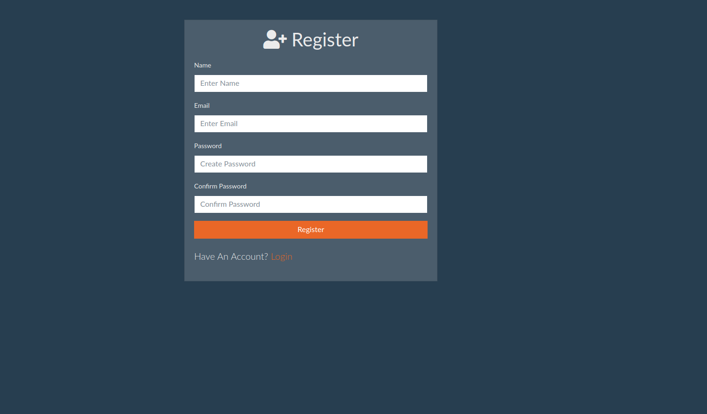

# Authentication




## Built With

- HTML
- EJS
- Bootswitch
- Bootstrap
- NodeJS
- Mongoose
- Express
- MongoDB
- Passport

### Usage

```sh
$ npm install
```

```sh
$ npm start
# Or run with Nodemon
$ npm run dev

# Visit http://localhost:5000
```

### MongoDB

Open "config/keys.js" and add your MongoDB URI, local or Atlas

## Author

👤 Ramon Carrillo

- GitHub: [@githubhandle](https://github.com/Ramon-Carrillo)
- Twitter: [@twitterhandle](https://twitter.com/ramon_de_NL)
- LinkedIn: [linkedin](https://www.linkedin.com/in/ramon-carrillo-54525a1ab/)

## Show your support

Give a ⭐️ if you like this project!


